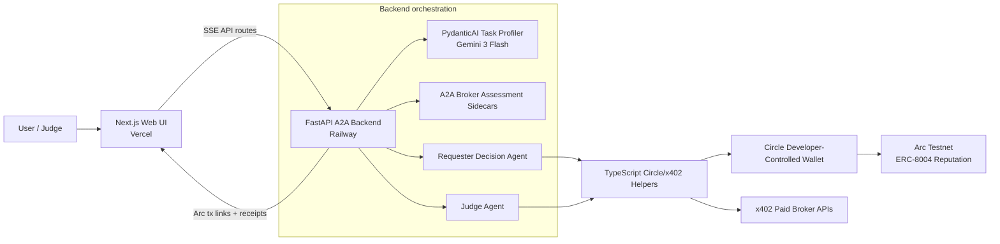

# Agent-to-Agent Marketplace on Arc

Web UI repository for the **Agentic Economy on Arc** hackathon submission.

Track: **Agent-to-Agent Payment Loop**

This project demonstrates AI agents coordinating work, paying each other in sub-cent USDC via Circle Nanopayments/x402, and recording quality feedback on Arc as ERC-8004 reputation.

## Repositories

The submission is split into two public repositories so each deploy target stays simple:

| Part | Repository | Deploy Target |
|---|---|---|
| Web UI | https://github.com/pktikkani/agentic-economy-on-arc | Vercel |
| A2A backend | https://github.com/pktikkani/agentic-economy-on-arc-backend | Railway |

If the hackathon form accepts only one repository URL, submit the web UI repo and mention the backend repo in the description/readme.

## What It Shows

- A requester agent receives a user task.
- Broker agents advertise paid capabilities: sentiment, price lookup, and summarization.
- The requester selects the best broker using service fit, price, and reputation.
- The buyer pays the broker per action using sub-cent USDC.
- A judge agent scores the broker output.
- The score is written to Arc as reputation feedback.
- A separate 50-transaction proof shows high-frequency sub-cent settlement viability.

## Hackathon Requirements

| Requirement | Status |
|---|---|
| Real per-action pricing <= $0.01 | $0.002 to $0.008 per broker call |
| 50+ on-chain transactions | The web UI has a separate 50-transaction proof run with individual Arc tx links |
| Circle infrastructure | Circle Developer-Controlled Wallets, Gateway/Nanopayments, x402 payment flow |
| Arc settlement | Arc testnet tx links are streamed into the UI and visible on Arcscan |
| Margin explanation | See [docs/MARGIN.md](docs/MARGIN.md) |
| Circle feedback | See [docs/CIRCLE_FEEDBACK.md](docs/CIRCLE_FEEDBACK.md) |
| Video notes | See [docs/VIDEO_NOTES.md](docs/VIDEO_NOTES.md) |

## Architecture



## Local Web Run

Create `.env.local`:

```bash
A2A_BACKEND_URL=http://127.0.0.1:8000
```

Then run:

```bash
npm install
npm run dev
```

Open http://localhost:3000.

The Python backend must be running separately. See the backend repo:

https://github.com/pktikkani/agentic-economy-on-arc-backend

## Vercel Deploy

Because this repository is now web-only, Vercel should use the repository root.

Recommended Vercel settings:

```text
Framework Preset: Next.js
Root Directory: empty
Install Command: default / no override
Build Command: default / no override
Output Directory: default / no override
Node.js Version: 22.x
```

Required Vercel environment variable:

```bash
A2A_BACKEND_URL=https://agentic-economy.prag-matic.com
```

Circle, Arc, Gemini, and broker private keys belong only in Railway/backend, not in Vercel.

## Backend Deploy

Deploy the backend repository to Railway:

https://github.com/pktikkani/agentic-economy-on-arc-backend

Railway target port for the custom domain: `8080`.

The backend owns:

- Gemini API key
- Circle API key and Developer-Controlled Wallet values
- Broker private keys
- Arc RPC/explorer config
- Payment, broker execution, and ERC-8004 reputation writes

## Validation

```bash
npm run lint
npm run build
```

## Submission Links

- Web repo: https://github.com/pktikkani/agentic-economy-on-arc
- Backend repo: https://github.com/pktikkani/agentic-economy-on-arc-backend
- Backend health: https://agentic-economy.prag-matic.com/health
- Buyer on Arc: https://testnet.arcscan.app/address/0x77a280cf6552ccc946204432c2d17941c4f41832
